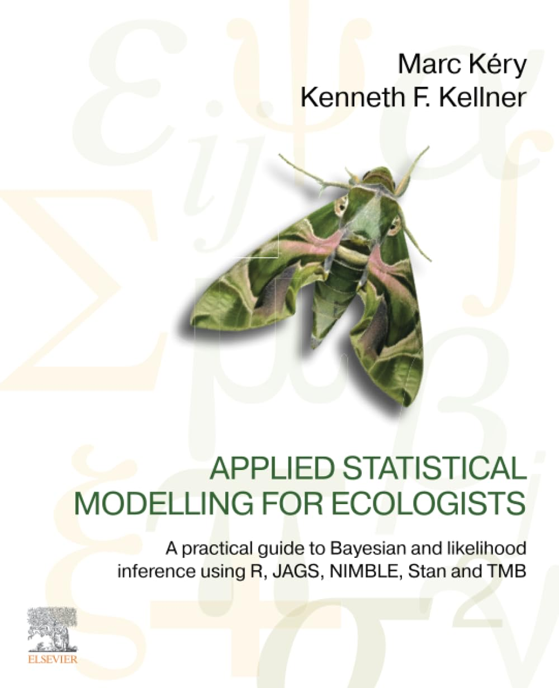
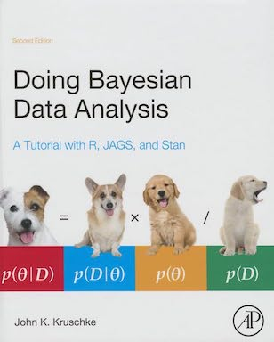

```{r setup, include = FALSE}
knitr::opts_chunk$set(cache = FALSE, 
                      echo = TRUE, 
                      message = FALSE, 
                      warning = FALSE,
                      fig.height=6, 
                      fig.width = 1.777777*6,
                      tidy = FALSE, 
                      comment = NA, 
                      highlight = TRUE, 
                      prompt = FALSE, 
                      crop = TRUE,
                      comment = "#>",
                      collapse = TRUE)
knitr::opts_knit$set(width = 60)
library(tidyverse)
library(reshape2)
theme_set(theme_light(base_size = 16))
make_latex_decorator <- function(output, otherwise) {
  function() {
      if (knitr:::is_latex_output()) output else otherwise
  }
}
insert_pause <- make_latex_decorator(". . .", "\n")
insert_slide_break <- make_latex_decorator("----", "\n")
insert_inc_bullet <- make_latex_decorator("> *", "*")
insert_html_math <- make_latex_decorator("", "$$")
```

# This workshop

## Objectives

* Try and demystify Bayesian statistics, and what we call MCMC.
* Make the difference between Bayesian and Frequentist analyses.
* Understand the Methods section of ecological papers doing Bayesian stuff.
* Run Bayesian analyses, safely hopefully.

## What's on our plate? 

+ Section 1 - Motivation and Bayes theorem. 

+ Section 2 - Markov chain Monte Carlo algorithms (MCMC). 

+ Section 3 - Introduction to `NIMBLE` and `brms`.

+ Section 4 - Priors. 

+ Section 5 - Case studies and GLMMs.

+ Section 6 - Conclusions.

## Material

+ Material from previous workshops (<https://oliviergimenez.github.io/bayesian-stats-with-R/>), a book in progress (<https://oliviergimenez.github.io/banana-book/>) and a paper on ten quick tips to get you started with Bayesian statistics (<https://hal.science/CEFE/hal-04731240v2>). 

+ All material prepared with `R`, with `R Markdown` to ensure reproducibility.

+ Slides, data and R codes on GitHub at <https://github.com/oliviergimenez/bayes-workshop> 

# What is Bayesian inference?

`r insert_slide_break()`


## A reminder on conditional probabilities

`r insert_inc_bullet()` $\Pr(A \mid B)$: Probability of A given B

`r insert_inc_bullet()` The ordering matters: $\Pr(A \mid B)$ is not the same as $\Pr(B \mid A)$.

`r insert_inc_bullet()` $\Pr(A \mid B) = \displaystyle{\frac{\Pr(A \text{ and } B)}{\Pr(B)}}$

`r insert_slide_break()`


## Screening for vampirism

`r insert_inc_bullet()` The chance of the  test being positive given you are a vampire is $\Pr(+|\text{vampire}) = 0.90$ (**sensitivity**).

`r insert_inc_bullet()` The chance of a negative test given you are mortal is $\Pr(-|\text{mortal}) = 0.95$ (**specificity**).


## What is the question?

`r insert_inc_bullet()` From the perspective of the test: Given a person is a vampire, what is the probability that the test is positive? $\Pr(+|\text{vampire}) = 0.90$.

`r insert_inc_bullet()` From the perspective of a person: Given that the test is positive, what is the probability that this person is a vampire? $\Pr(\text{vampire}|+) = \; ?$

`r insert_inc_bullet()` Assume that vampires are rare, and represent only $0.1\%$ of the population. This means that $\Pr(\text{vampire}) = 0.001$.


## What is the answer? Bayes' theorem to the rescue!

\begincols
\begincol


\endcol

\begincol

- $\Pr(\text{vampire}|+) = \displaystyle{\frac{\Pr(\text{vampire and } +)}{\Pr(+)}}$

`r insert_pause()`

- $\Pr(\text{vampire and } +) = \Pr(\text{vampire}) \; \Pr(+ | \text{vampire}) = 0.0009$

`r insert_pause()`

- $\Pr(+) = 0.0009 + 0.04995 = 0.05085$

`r insert_pause()`

- $\Pr(\text{vampire}|+) = 0.0009/0.05085 = 0.02$

\endcol
\endcols

`r insert_pause()`

$$\Pr(\text{vampire}|+)= \displaystyle{\frac{ \Pr(+|\text{vampire}) \; \Pr(\text{vampire})}{\Pr(+)}}$$


## Bayes' theorem

\begincols
\begincol

* A theorem about conditional probabilities.

* $\Pr(B \mid A) = \displaystyle{\frac{ \Pr(A \mid B) \; \Pr(B)}{\Pr(A)}}$

\endcol

\begincol


\endcol
\endcols


## Bayes' theorem

`r insert_inc_bullet()` Easy to mess up with letters. Might be easier to remember when written like this:

$$ \Pr(\text{hypothesis} \mid \text{data}) = \frac{ \Pr(\text{data} \mid \text{hypothesis}) \; \Pr(\text{hypothesis})}{\Pr(\text{data})} $$

`r insert_inc_bullet()` The "hypothesis" is typically something unobserved or unknown. It's what you want to learn about using the data. 

`r insert_inc_bullet()` For regression models, the "hypothesis" is a parameter (intercept, slopes or error terms).

`r insert_inc_bullet()` Bayes theorem tells you the probability of the hypothesis given the data.


## What is doing science after all?

How plausible is some hypothesis given the data?

$$ \Pr(\text{hypothesis} \mid \text{data}) = \frac{ \Pr(\text{data} \mid \text{hypothesis}) \; \Pr(\text{hypothesis})}{\Pr(\text{data})} $$


## Why is Bayesian statistics not the default?

`r insert_inc_bullet()` Due to practical problems of implementing the Bayesian approach, and some wars of male statisticians's egos, little advance was made for over two centuries.

`r insert_inc_bullet()` Recent advances in computational power coupled with the development of new methodology have led to a great increase in the application of Bayesian methods within the last two decades.


## Frequentist versus Bayesian	

`r insert_inc_bullet()` Typical stats problems involve estimating parameter $\theta$ with available data.

`r insert_inc_bullet()` The frequentist approach (**maximum likelihood estimation** – MLE) assumes that the parameters are fixed, but have unknown values to be estimated.

`r insert_inc_bullet()` Classical estimates generally provide a point estimate of the parameter of interest.

`r insert_inc_bullet()` The Bayesian approach assumes that the parameters are not fixed but have some fixed  unknown distribution - a distribution for the parameter.


## What is the Bayesian approach?	

* The approach is based upon the idea that the experimenter begins with some prior beliefs about the system.

`r insert_pause()`

* And then updates these beliefs on the basis of observed data.

`r insert_pause()`

* This updating procedure is based upon the Bayes’ Theorem:

$$\Pr(A \mid B) = \frac{\Pr(B \mid A) \; \Pr(A)}{\Pr(B)}$$


## What is the Bayesian approach?	

* Schematically if $A = \theta$ and $B = \text{data}$, then

`r insert_pause()`

* The Bayes' theorem

$$\Pr(A \mid B) = \frac{\Pr(B \mid A) \; \Pr(A)}{\Pr(B)}$$

`r insert_pause()`

* Translates into:

$$\Pr(\theta \mid \text{data}) = \frac{\Pr(\text{data} \mid \theta) \; \Pr(\theta)}{\Pr(\text{data})}$$


## Bayes' theorem	

$${\color{red}{\Pr(\theta \mid \text{data})}} = \frac{\color{blue}{\Pr(\text{data} \mid \theta)} \; \color{green}{\Pr(\theta)}}{\color{orange}{\Pr(\text{data})}}$$

`r insert_pause()`

* \textcolor{red}{Posterior distribution}: Represents what you know after having seen the data. The basis for inference, a distribution, possibly multivariate if more than one parameter ($\theta$). 

`r insert_pause()`

* \textcolor{blue}{Likelihood}: We know that quantity, same as in the MLE approach.

`r insert_pause()`

* \textcolor{green}{Prior distribution}: Represents what you know before seeing the data. The source of much discussion about the Bayesian approach.

`r insert_pause()`

* $\color{orange}{\Pr(\text{data}) = \int \Pr(\text{data} \mid \theta) \;\Pr(\theta) d\theta }$: Possibly high-dimensional integral, difficult if not impossible to calculate. This is one of the reasons why we need simulation (MCMC) methods.

# Guiding example

## Survival example

* 120 deer were radio-tracked over winter.
* 61 close to a plant, 59 far from any human activity.
* How to estimate winter survival?

|            | Released   | Alive | Dead | Other |
|------------+----------+-------+------+-------| 
| treatment  | 61 | 19 | 38 | 4 |
| control    | 59 | 21 | 38 | 0 |


`r insert_slide_break()`

`r insert_inc_bullet()` So, $n = 57$ deer were assigned to the treatment group of which $k=19$ survived the winter.

`r insert_inc_bullet()` Of interest is the probability of winter survival, call it $\theta$, for the general population within the treatment area.

`r insert_inc_bullet()` The obvious estimate is simply to take the ratio $k/n=19/57$.


`r insert_inc_bullet()` How would the classical statistician justify this estimate?

`r insert_slide_break()`

* Our model is that we have a Binomial experiment (assuming independent and identically distributed draws from the population).

`r insert_pause()`

* $K$ the number of alive individuals at the end of the winter, so that $P(K=k) = \binom{n}{k}\theta^k(1-\theta)^{n-k}$.

`r insert_pause()`

* The classical approach is to maximise the corresponding likelihood with respect to $\theta$ to obtain the entirely plausible MLE:

$$ \hat{\theta} = k/n = 19/57$$.

## The Bayesian approach

`r insert_inc_bullet()` The Bayesian starts off with a prior.

`r insert_inc_bullet()` Now, the one thing we know about $\theta$ is that is a continuous random variable and that it lies between zero and one.

`r insert_inc_bullet()` Thus, a suitable prior distribution might be the Beta defined on $[0,1]$.

`r insert_inc_bullet()` What is the Beta distribution?

## What is the Beta distribution?

$$
q(\theta \mid a, b) = \frac{1}{\text{Beta}(a, b)}{\theta^{a - 1}} {(1-\theta)^{b - 1}} 
$$

with $\text{Beta}(a, b) = \displaystyle{\frac{\Gamma(a)\Gamma(b)}{\Gamma(a+b)}}$ and $\Gamma(n) = (n-1)!$

## What is the Beta distribution?

+ The beta distribution is continuous between 0 and 1, and extends the uniform distribution to situations where not all outcomes are equally likely. 

+ It has two parameters $a$ and $b$ that control its shape.

+ Note that for $a = b = 1$, we get the uniform distribution between 0 and 1.

+ The expectation (or mean) of a beta($a$,$b$) is $\displaystyle{\frac{a}{a + b}}$.

`r insert_slide_break()`

```{r, echo=FALSE} 
x <- seq(0, 1, length=200)
par(mfrow = c(2,3))
# distribution a posteriori beta
plot(x,dbeta(x, 1, 1),type='l',xlab='q',ylab='Density',main='beta(1,1)',lwd=3,col='red',ylim=c(0,1.5))
plot(x,dbeta(x, 2, 1),type='l',xlab='q',ylab='',main='beta(2,1)',lwd=3,col='red',ylim=c(0,2))
plot(x,dbeta(x, 1, 2),type='l',xlab='q',ylab='',main='beta(1,2)',lwd=3,col='red',ylim=c(0,2))
plot(x,dbeta(x, 2, 2),type='l',xlab='q',ylab='Density',main='beta(2,2)',lwd=3,col='red',ylim=c(0,1.5))
plot(x,dbeta(x, 10, 10),type='l',xlab='q',ylab='',main='beta(10,10)',lwd=3,col='red',ylim=c(0,3.5))
plot(x,dbeta(x, 0.8, 0.8),type='l',xlab='q',ylab='',main='beta(0.8,0.8)',lwd=3,col='red',ylim=c(0.5,2.5))
```

## The Bayesian approach

* We assume a priori that $\theta \sim Beta(a,b)$ so that $\Pr(\theta) = \theta^{a-1} (1 - \theta)^{b-1}$

`r insert_pause()`

* Then we have:

$$
\begin{aligned}
{\color{red}{Pr(\theta \mid k)}} & \propto {\color{blue}{\binom{n}{k}\theta^k(1-\theta)^{n-k}}} \; {\color{green}{\theta^{a-1} (1 - \theta)^{b-1}}}\\
& \propto {\theta^{(a+k)-1}} {(1-\theta)^{(b+n-k)-1}} 
\end{aligned}
$$

`r insert_pause()`

* That is: 

$$ \theta \mid k \sim Beta(a+k,b+n-k)$$

`r insert_pause()`

* Take a Beta prior with a Binomial likelihood, you get a Beta posterior (conjugacy)

## Application to the deer example

`r insert_inc_bullet()` Posterior distribution of survival is $\theta \sim Beta(a+k,b+n-k)$.

`r insert_inc_bullet()` If we take a Uniform prior, i.e. $Beta(1,1)$, then we have: 

`r insert_inc_bullet()` $\theta_{treatment} \sim Beta(1+19,1+57-19)=Beta(20,39)$

`r insert_inc_bullet()` Note that in this specific situation, the posterior has an explicit expression, easy to manipulate.

`r insert_inc_bullet()` In particular, $E(Beta(a,b)) = \displaystyle{\frac{a}{a+b}} = 20/59$ to be compared with the MLE $19/57$.

## A general result

**This is a general result, the Bayesian and frequentist estimates will always agree if there is sufficient data, so long as the likelihood is not explicitly ruled out by the prior.**

## Prior $Beta(1,1)$ and posterior survival $Beta(20,39)$
```{r echo=FALSE}
x <- seq(0, 1, length=200)
# distribution a posteriori beta
plot(x,dbeta(x, 20,39),type='l',xlab='',ylab='',main='',lwd=3,col='red')
# distribution a priori uniforme
points(x,dbeta(x, 1, 1),type='l',lwd=3)
```

## Prior $Beta(1,1)$ and posterior survival $Beta(20,39)$
```{r echo=FALSE}
x <- seq(0, 1, length=200)
# distribution a posteriori beta
plot(x,dbeta(x, 20,39),type='l',xlab='',ylab='',main='',lwd=3,col='red')
# distribution a priori uniforme
points(x,dbeta(x, 1, 1),type='l',lwd=3)
abline(v = 19/57, lwd = 3, lty = 2, col = 'blue')
text(x = 0.28, y = 0, 'MLE', col = 'blue')
```


# Summary

## Summary

+ With the Bayes' theorem, you update your beliefs (prior) with new data (likelihood) to get posterior beliefs (posterior): posterior $\propto$ likelihood $\times$ prior.

+ In some simple situations, it is possible to explicitly calculate the posterior distribution of model parameters. 

+ In general though, when applying the Bayes' theorem, you get high-dimensional integral, difficult if not impossible to calculate. This is one of the reasons why we need simulation (MCMC) methods.

# Further reading

`r insert_slide_break()`

```{r, fig.align = 'center', echo = FALSE, out.width = '80%'}

```

<https://www.elsevier.com/books-and-journals/book-companion/9780443137150>

`r insert_slide_break()`

```{r, fig.align = 'center', echo = FALSE}

```

<https://sites.google.com/site/doingbayesiandataanalysis/>

`r insert_slide_break()`

```{r, fig.align = 'center', echo = FALSE}
knitr::include_graphics('img/bayesrules.jpeg')
```

<https://www.bayesrulesbook.com/>

`r insert_slide_break()`

```{r, fig.align = 'center', echo = FALSE}
knitr::include_graphics('img/gelmanhill.png')
```

<https://sites.stat.columbia.edu/gelman/arm/>

`r insert_slide_break()`

```{r, fig.align = 'center', echo = FALSE}
knitr::include_graphics('img/mcelreath.png')
```

<https://xcelab.net/rm/>