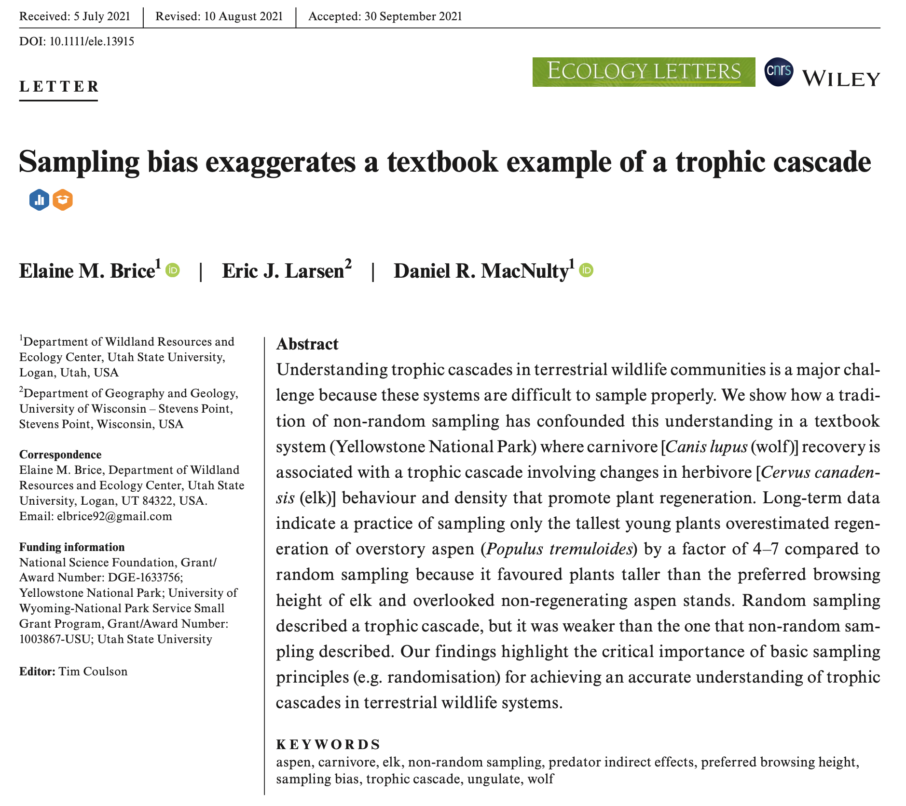

```{r setup, include = FALSE}
knitr::opts_chunk$set(cache = TRUE, 
                      echo = TRUE, 
                      message = FALSE, 
                      warning = FALSE,
                      fig.height=6, 
                      fig.width = 1.777777*6,
                      tidy = FALSE, 
                      comment = NA, 
                      highlight = TRUE, 
                      prompt = FALSE, 
                      crop = TRUE,
                      comment = "#>",
                      collapse = TRUE)
knitr::opts_knit$set(width = 60)
library(tidyverse)
library(reshape2)
theme_set(theme_light(base_size = 16))
make_latex_decorator <- function(output, otherwise) {
  function() {
      if (knitr:::is_latex_output()) output else otherwise
  }
}
insert_pause <- make_latex_decorator(". . .", "\n")
insert_slide_break <- make_latex_decorator("----", "\n")
insert_inc_bullet <- make_latex_decorator("> *", "*")
insert_html_math <- make_latex_decorator("", "$$")
```

# What is a Generalized Linear Model (or GLM)?

## Survival of passengers on the Titanic ~ Class

Read `titanic_long.csv` dataset.

```{r read_titanic, collapse=T}
titanic <- read.csv("dat/titanic_long.csv")
head(titanic)
```


## Let's fit a linear model

```{r titanic_lm, echo=1}
titanic.lm <- lm(survived ~ class, data = titanic)
#library(broom)
#tidy(m5)
#layout(matrix(1:4, nrow=2))
#plot(m5)
```


## Clearly, the residuals are not normal!

```{r, echo=FALSE}
hist(resid(titanic.lm), xlab = 'residuals', main = '')
```


## Generalized linear models (GLMs)

* GLMs extend the linear model to scenarios that involve **non-normal error distributions**, hence the term \alert{generalized}

* The **mean response** is expressed as a **linear function of the predictors** using a **link function**, hence the term \alert{linear}

## Generalized Linear Models

1. **Response variable**
    + Bernoulli/Binomial: Binary variables 0/1
    + Poisson: Counts 0, 1, 2, ...
    + Normal: Real values
    + etc
  
2. **Predictors** (continuous or categorical)

3. **Link function**
    + Gaussian: identity
    + Binomial: logit
    + Poisson: log
    + Type in `?family`

## Bernoulli/Binomial distribution (logistic regression) 

- Response variable: Yes/No (e.g. dead/alive, male/female, presence/absence)

- Link function: `logit` 

$$
  \begin{aligned} 
  \text{logit}(p) = \ln \left( \dfrac {p} {1-p}\right) \\ 
  \end{aligned} 
$$

- Then, if predictor is $x$

$$  
  \begin{aligned} 
  \text{Response} \sim \text{Distribution(Mean Response)} \\
  Y_i \sim \text{Bernoulli}(p_i) \\
  \text{logit}(p_i) = a + b \; x_i\\
p_i = \text{logit}^{-1}(a + b \; x_i) = \dfrac {e^{a+b \; x_i}} {1+e^{a+b \; x_i}} \\
  \end{aligned}
$$


## Poisson distributoin (Poisson regression)

- Response variable: Counts (0, 1, 2, 3...)

- Link function: `log`

$$
  \begin{aligned} 
  \text{Response} \sim \text{Distribution(Mean Response)} \\
  Y_i \sim \text{Poisson}(\lambda_i) \\
  \log(\lambda_i) = a + b \; x_i \\  
  \lambda_i = e^{a+b \; x_i} \\ 
  \end{aligned} 
$$


## Back to survival of Titanic passengers 

How many passengers traveled in each class?
```{r,collapse=T}
tapply(titanic$survived, titanic$class, length)
```

## Back to survival of Titanic passengers 

How many survived?
```{r,collapse=TRUE}
tapply(titanic$survived, titanic$class, sum)
```

## Back to survival of Titanic passengers 

What proportion survived in each class?
```{r,collapse=TRUE}
as.numeric(tapply(titanic$survived, titanic$class, mean))
```

## Back to survival of Titanic passengers (package `dplyr`)

Arrange passenger survival according to class

```{r eval = FALSE}
library(dplyr)
summarise(group_by(titanic, class, survived), count = n())
```


## Back to survival of Titanic passengers (package `dplyr`)

Same manipulation using the pipe operator `%>%`

```{r eval = FALSE}
titanic %>%
  group_by(class, survived) %>%
  summarise(count = n())
```

## Back to survival of Titanic passengers (package `dplyr`)

Arrange passenger survival according to class
```{r, message=FALSE, collapse=TRUE, size='tinysize',echo=FALSE}
library(dplyr)
titanic %>%
  dplyr::count(class, survived, sort = TRUE)
```

## Or graphically...

```{r, echo = FALSE, out.width="90%"}
titanic %>%
  mutate(survived = as_factor(survived)) %>%
  dplyr::count(class, survived) %>%
  ggplot(aes(x = class, y = n, fill = survived)) +
  geom_col()
```


## Fitting GLMs in R: `glm` function

```{r titanic_glm, echo=1}
titanic.glm <- glm(survived ~ class, data = titanic, family = binomial)
library(broom)
tidy(titanic.glm)
```

\alert{These estimates are on the logit scale!}


## Interpreting logistic regression outputs 

Parameter estimates on the logit scale:
```{r tit_glm_coef, echo=FALSE,collapse=TRUE}
coef(titanic.glm)
```

\alert{We need to back-transform} using the inverse logit function:  
```{r tit_glm_invlogit, collapse=TRUE}
plogis(coef(titanic.glm)[1]) # crew survival probability
```

Looking at the data, the proportion of crew who survived is:
```{r crew_surv,collapse=TRUE}
sum(titanic$survived[titanic$class == "crew"]) / 
  nrow(titanic[titanic$class == "crew", ])
```

## Probability of survival for 1st class passengers? 

Needs to add intercept (baseline) to the parameter estimate:
```{r first_surv, collapse=TRUE}
plogis(coef(titanic.glm)[1] + coef(titanic.glm)[2])
```

Again this value matches the data: 
```{r first_surv_data, collapse=TRUE}
sum(titanic$survived[titanic$class == "first"]) /   
  nrow(titanic[titanic$class == "first", ])
```

# Generalized linear *mixed* models (or GLMMs)

## What are random effects?

* \alert{Mixed models} include both fixed and random effects.

* Random effects are statistical parameters that attempt to \alert{explain noise caused by sub-populations} of the population you are trying to model.

* A random-effect model assumes that the dataset being analysed consists of \alert{a hierarchy of different populations} whose differences relate to that hierarchy.

* Measurement that come \alert{in groups}. E.g. classrooms within schools, chapters within books, populations within species, frogs within ponds.

* Sex or age are not clusters; if we were to sample again, we would take the same levels, e.g. male/female and young/old.

## Why do we need random effects?

* Model the clustering itself.

* Interested in variance components (environmental vs. genetic variance)

* Control for bias due to pseudoreplication (time, space, individual)

## GL\alert{M}M formulation

$$
\begin{aligned}
Y_{i{\color{red}{j}}} \sim \text{Distribution(Mean Response}_{i{\color{red}{j}}}\text{)} \\
\text{Mean Response}_{i{\color{red}{j}}} = \beta_{0\color{red}{j}} +  \beta_1 \; x_{i1} + \ldots +  \beta_P \; x_{iP}\\
\beta_{0{\color{red}{j}}} \sim \text{Normal}(\mu_{group},\sigma^2_{group})\\
\end{aligned}
$$


## Model fitting in R

* Linear Mixed Models (LMMs) and Generalized Linear Mixed Models (GLMMs)
```{r echo=TRUE, eval=FALSE}
library(lme4)
my_LMM <- lmer(y ~ x + (1 | group)) # LMM
my_GLMM <- glmer(y ~ x + (1 | group), family = Distribution) # GLMM
```

* `x` is the \alert{fixed} factor(s)
* `1` is the \alert{random} factor(s), here the intercept
* `group` is for the \alert{grouping} variable


# GLMM with Poisson response

## From Jason Matthiopoulos' book

```{r, out.width = '4cm',out.height='6cm',fig.align='center',echo=FALSE}

```

## Longitudinal study on coral reef

> A survey of a coral reef uses 10 predefined linear transects covered by divers once every week. The response variable of interest is the abundance of a particular species of anemone as a function of water temperature. Counts of anemones are recorded at 20 regular line segments along the transect. The following piece of code will generate a data set with realistic properties according to the above design. Make sure you understand what it is doing. You might want to explain the script to the colleague next to you. Also, to try and make sense of the code of others, it is always good to plot and/or run small sections of the code.

## Data generation

\scriptsize

```{r}
transects <- 10
data <- NULL
for (tr in 1:transects){
  # random effect (intercept)
  ref <- rnorm(1,0,.5)
  # water temperature gradient
  t <- runif(1, 18,22) + runif(1,-.2,0.2)*1:20
  # Anemone gradient (expected response)
  ans <- exp(ref -14 + 1.8 * t - 0.045 * t^2)
  # actual counts on 20 segments of the current transect
  an <- rpois(20, ans)
  data <- rbind(data, cbind(rep(tr, 20), t, an))
}
```

## Our job

* Generate a data set using the anemone code.

* Using `NIMBLE` and `brms`, fit a GLMM with quadratic effect of temperature and a random intercept.

* Fit the same model to the same data in a Frequentist framework using function `lme4::glmer()`.

* Compare the estimates.

## Make sense of the code

* Always difficult to make sense of the code of others.

* Good to plot and/or run small sections of the code.

## Make sense of the code

```{r eval = FALSE}
# random effect (intercept)
ref <- rnorm(1,0,.5)
# water temperature gradient
t <- runif(1, 18,22) + runif(1,-.2,0.2)*1:20

plot(t,type='l')
```

## Make sense of the code

```{r echo = FALSE}
# random effect (intercept)
ref <- rnorm(1,0,.5)
# water temperature gradient
t <- runif(1, 18,22) + runif(1,-.2,0.2)*1:20

plot(t,type='l')
```

## Make sense of the code

```{r eval = FALSE}
# Anemone gradient (expected response)
ans <- exp(ref -14 + 1.8 * t - 0.045 * t^2)
plot(t,log(ans),type='l')
```

## Make sense of the code

```{r echo = FALSE}
ans <- exp(ref -14 + 1.8 * t - 0.045 * t^2)
plot(t,log(ans),type='l')
```

## Make sense of the code

```{r eval = FALSE}
data <- data.frame(Transect = data[,1],
                   Temperature = data[,2],
                   Anemones = data[,3])

plot(data$Temperature, data$Anemones)
```

## Make sense of the code

```{r echo = FALSE}
data <- data.frame(Transect = data[,1],
                   Temperature = data[,2],
                   Anemones = data[,3])

plot(data$Temperature, data$Anemones)
```

## Write down model

\begin{align*}
   \text{Count}_i &\sim \text{Poisson(}\lambda_i) &\text{[likelihood]}\\
  \text{log}(\lambda_i) &= a_{\text{TRANSECT[i]}} + b_1 \; \text{temp}_{i} + b_2 \; \text{temp}^2_{i} &\text{[linear model]} \\
  a_j &\sim \text{Normal}(\bar{a}, \sigma) &\text{[prior for varying intercepts}] \\
  \bar{a} &\sim \text{Normal}(0, 1.5) &\text{[prior for population mean}] \\
  \sigma &\sim \text{Uniform}(0, 10) &\text{[prior for standard deviation}] \\
  b_1, b_2 &\sim \text{Normal}(0, 1.5) &\text{[prior for slopes}] \\
\end{align*}

# NIMBLE

## Load package

```{r}
library(nimble)
```

## Standardize temperature covariate

\scriptsize

```{r}
boo <- data$Temperature
data$Temp <- (boo - mean(boo)) / sd(boo)
head(data)
```

## Model

\scriptsize

```{r}
model <- nimbleCode({
  for (i in 1:n){
    count[i] ~ dpois(lambda[i])
    log(lambda[i]) <- intercept[transect[i]] + slope[1] * x[i] + slope[2] * pow(x[i],2)
  }
  for (j in 1:nbtransects){
    intercept[j] ~ dnorm(mu.a, sd = sigma.a)
  }
  mu.a ~ dnorm(0, sd = 1.5)
  sigma.a ~ dunif(0, 10)
  slope[1] ~ dnorm(0, sd = 1.5)
  slope[2] ~ dnorm(0, sd = 1.5)
})
```

## Data

```{r}
my.constants <- list(n = nrow(data),
                     nbtransects = transects)
my.data <- list(x = data$Temp,
                count = data$Anemones,
                transect = data$Transect)
```

## Initial values

```{r}
init1 <- list(intercept = rnorm(transects), slope = rnorm(2),
              mu.a = rnorm(1), sigma.a = runif(1))
init2 <- list(intercept = rnorm(transects), slope = rnorm(2),
              mu.a = rnorm(1), sigma.a = runif(1))
initial.values <- list(init1, init2)
```

## Parameters to monitor (and save)

```{r}
parameters.to.save <- c("slope", "mu.a", "sigma.a")
```

## Set up MCMC details

```{r}
n.iter <- 5000
n.burnin <- 1000
n.chains <- 2
```

## Run model

```{r, warning=FALSE, message=FALSE, eval = FALSE}
mcmc.output <- nimbleMCMC(code = model,
                          data = my.data,
                          constants = my.constants,
                          inits = initial.values,
                          monitors = parameters.to.save,
                          niter = n.iter,
                          nburnin = n.burnin,
                          nchains = n.chains)
```

```{r, cache = TRUE, echo = FALSE, warning = FALSE, message=FALSE}
mcmc.output <- nimbleMCMC(code = model,
                          data = my.data,
                          constants = my.constants,
                          inits = initial.values,
                          monitors = parameters.to.save,
                          niter = n.iter,
                          nburnin = n.burnin,
                          nchains = n.chains,
                          progressBar = FALSE)
```

## Post-process results

\scriptsize

```{r}
library(MCMCvis)
MCMCsummary(object = mcmc.output, round = 2)
```

## Get regression coefficients

Convert regression coefficients from scaled to non-scaled and compare to values used to generate data (from <https://stats.stackexchange.com/questions/361995/how-to-convert-coefficients-from-quadratic-function-from-scaled-to-not-scaled-co>)

Pull two chains together:
```{r}
samples <- rbind(mcmc.output$chain1,mcmc.output$chain2)
```

## Get regression coefficients

```{r}
sbzero <- samples[,'mu.a']
sbun <- samples[,'slope[1]']
sbdeux <- samples[,'slope[2]']

mu <- mean(boo)
sg <- sd(boo)
```

## Get regression coefficients

\tiny

```{r out.width="80%"}
bzero <- sbzero - sbun*mu/sg + sbdeux*mu^2/(sg^2)
hist(bzero)
abline(v = -14, col = "red", lwd = 2)
```

## Get regression coefficients

\tiny

```{r out.width="80%"}
bun <- sbdeux/sg - 2 * sbdeux * mu / (sg^2)
hist(bun)
abline(v = 1.8, col = "red", lwd = 2)
```

## Get regression coefficients

\tiny

```{r out.width="80%"}
bdeux <- sbdeux/(sg^2)
hist(bdeux)
abline(v = - 0.045, col = "red", lwd = 2)
```

# Frequentist approach

## `lme4` fit

\tiny

```{r}
library(lme4)
fit_lme4 <- glmer(Anemones ~ Temp + I(Temp^2) + (1 | Transect), data = data, family = poisson)
fit_lme4
```

## Visualize

```{r}
visreg::visreg(fit_lme4, xvar = 'Temp')
```

# brms

## Implementation

```{r eval = FALSE}
library(brms)
bayes.brms <- brm(Anemones ~ Temp + I(Temp^2) + (1 | Transect),
                  data = data,
                  family = poisson("log"),
                  chains = 2, # nb of chains
                  iter = 5000, # nb of iterations, including burnin
                  warmup = 1000, # burnin
                  thin = 1)
```

```{r message=FALSE, warning=FALSE, include=FALSE}
library(brms)
bayes.brms <- brm(Anemones ~ Temp + I(Temp^2) + (1 | Transect),
                  data = data,
                  family = poisson("log"),
                  chains = 2, # nb of chains
                  iter = 5000, # nb of iterations, including burnin
                  warmup = 1000, # burnin
                  thin = 1)
```

## Numerical summaries

\tiny

```{r}
summary(bayes.brms)
```

## Convergence

```{r out.width="80%"}
plot(bayes.brms)
```

## Quality of fit assessment

```{r out.width="80%"}
pp_check(bayes.brms, ndraws = 100, type = 'ecdf_overlay')
```

## Model comparison

+ What if we’d like to test the effect of temperature using WAIC?

+ We fit a model with no effect of temperature:

```{r eval = FALSE}
bayes.brms2 <- brm(Anemones ~ 1 + (1 | Transect),
                  data = data,
                  family = poisson("log"),
                  chains = 2, # nb of chains
                  iter = 5000, # nb of iterations, including burnin
                  warmup = 1000, # burnin
                  thin = 1)
```
```{r message=FALSE, warning=FALSE, include=FALSE}
bayes.brms2 <- brm(Anemones ~ 1 + (1 | Transect),
                  data = data,
                  family = poisson("log"),
                  chains = 2, # nb of chains
                  iter = 5000, # nb of iterations, including burnin
                  warmup = 1000, # burnin
                  thin = 1)
```

## Model comparison

Then we compare both models, by ranking them with their WAIC:

```{r warning=FALSE, message=FALSE}
waic1 <- waic(bayes.brms) # waic model w/ temperature
waic2 <- waic(bayes.brms2) # waic model wo/ temperature
data.frame(with_temp = waic1$waic,
           without_temp = waic2$waic)
```

# GLMM with binomial response

## From a paper by Brice, Larsen and MacNulty (2021) 

```{r, out.width="60%",fig.align='center',echo=FALSE}
    
```

## Read in data

\scriptsize 

```{r}
rawdat <- read_csv("dat/Aspen_Data.csv")
head(rawdat)
```

## Data collection (1)

>> We measured browsing and height of young aspen in 113 plots distributed randomly across the study area. Each plot was a 1 x 20 m belt transect located randomly within an aspen stand that was itself randomly selected from an inventory of stands with respect to high and low wolf-use areas. The inventory was a list of 992 grid cells (240 × 360 m) that contained at least one stand. A ‘stand’ was a group of tree-size aspen (more than 10 cm diameter at breast height) in which each tree was less than 30 m from every other tree. One hundred and thirteen grid cells were randomly selected from the inventory, one stand was randomly selected from each cell, and one plot was randomly established in each stand.

## Data collection (2)

>> We measured aspen at the end of the growing season (late July–September), focusing on plants less than 600 cm tall and more than 1 year old, which we termed ‘young aspen’. For each stand, we measured every young aspen within a plot (‘random stems’) and each of the five tallest young aspen within the stand (‘5T stems’). For all young aspen, we measured browsing status (browsed or unbrowsed) and height of the leader (tallest) stem. A leader was ‘browsed’ if its growth from the previous growing season had been eaten, which we identified by a sharp, pruned edge at the base of the current year's growth. Most plots were measured nearly every year since 1999 and our analysis focused on data from 10 years (2007–2014, 2016–2017) in which sampled stands included measurements of random and 5T stems.

## Data collection (3)

>> We combined measurements of 5T and random stems into one data set of all stems (N = 18,623) across all years (N = 10 years).

## Our job

* Read in the data and get familiar with it.

* Using `NIMBLE` and `brms`, fit a GLMM with 'Browsed' as the response variable. Consider year and type of stems (random or 5T stems) as explanatory variables. Use stand identity as a random effect on the intercept. 

* Fit the same model to the same data in a Frequentist framework using function `lme4::glmer()`. 

* Compare the estimates.

## Read in data

\scriptsize 

```{r}
str(rawdat)
```

## Metadata

+ Plot: individual identifier for each of 113 plots distributed randomly across the study area. Each plot was a 1 × 20 m belt transect located randomly within an aspen stand 

+ Year: year in which aspen was sampled

+ Tree: individual identifier for each stem within a plot

+ Browse: denotes the browsing status (browsed = 1,unbrowsed = 0) of the leader (tallest) stem. A leader was ‘browsed’ if its growth from the previous growing season had been eaten

+ Height: height (cm) of the leader stem of each individual aspen

+ Type: sampling method. Every young aspen within a plot is a "random" stem, and each of the five tallest young aspen within the stand is a "5T" stem.

## Format data

```{r}
dat <- rawdat %>%
  transmute(y = Browse,
         type = if_else(Type == "5T", 1, 0), # numeric
         year = as.integer(Year) - 2006,     # year starts at 1
         id = as_factor(Plot))               # id is a factor
```


## Write down model

\begin{align*}
   \text{Brwsed}_i &\sim \text{Bernoulli(}p_i) &\text{[likelihood]}\\
  \text{logit}(p_i) &= a_{\text{ID[i]}} + b_1 \; \text{year}_{i} + b_2 \; \text{type}_{i} &\text{[linear model]} \\
  a_j &\sim \text{Normal}(\bar{a}, \sigma) &\text{[prior for varying intercepts}] \\
  \bar{a} &\sim \text{Normal}(0, 1.5) &\text{[prior for population mean}] \\
  \sigma &\sim \text{Uniform}(0, 10) &\text{[prior for standard deviation}] \\
  b_1, b_2 &\sim \text{Normal}(0, 1.5) &\text{[prior for slopes}] \\
\end{align*}

# NIMBLE

## Load package

```{r}
library(nimble)
```

## Model

\scriptsize

```{r}
model <- nimbleCode({
  for (i in 1:n){
    y[i] ~ dbern(p[i])
    logit(p[i]) <- a[id[i]] + beta[1] * type[i] + beta[2] * year[i] + beta[3] * year[i] * type[i]
  }
  for (j in 1:nblevels){
    a[j] ~ dnorm(mu.a, sd = sigma.a)
  }
  for (k in 1:3){
    beta[k] ~ dnorm(0, sd = 1.5)
  }
  mu.a ~ dnorm(0, sd = 1.5)
  sigma.a ~ dunif(0,10)
})
```

## Data

```{r}
my.constants <- list(id = as.numeric(as_factor(dat$id)), 
                     n = length(dat$y),
                     nblevels = length(levels(as_factor(dat$id))))
my.data <- list(y = dat$y, 
                type = dat$type,
                year = dat$year)

```

## Initial values

```{r}
init1 <- list(mu.a = -0.5, sigma.a = 0.1, beta = rnorm(3))
init2 <- list(mu.a = 0.5, sigma.a = 0.5, beta = rnorm(3))
initial.values <- list(init1, init2)
```

## Parameters to monitor (and save)

```{r}
parameters.to.save <- c("mu.a", "sigma.a", "beta")
```

## Set up MCMC details

```{r}
n.iter <- 5000
n.burnin <- 1000
n.chains <- 2
```

## Run model

```{r, warning=FALSE, message=FALSE, eval = FALSE}
mcmc.output <- nimbleMCMC(code = model,
                          data = my.data,
                          constants = my.constants,
                          inits = initial.values,
                          monitors = parameters.to.save,
                          niter = n.iter,
                          nburnin = n.burnin,
                          nchains = n.chains)
```

```{r, cache = TRUE, echo = FALSE, warning = FALSE, message=FALSE}
mcmc.output <- nimbleMCMC(code = model,
                          data = my.data,
                          constants = my.constants,
                          inits = initial.values,
                          monitors = parameters.to.save,
                          niter = n.iter,
                          nburnin = n.burnin,
                          nchains = n.chains,
                          progressBar = FALSE)
```

## Post-process results

\scriptsize

```{r}
library(MCMCvis)
MCMCsummary(object = mcmc.output, round = 2)
```

## Visualize (1)

\tiny

```{r}
# pool two chains together
samples <- rbind(mcmc.output$chain1, mcmc.output$chain2)
nsim <- nrow(samples)

# get values sampled in posterior distribution of regression parameters
beta1 <- samples[,'beta[1]']
beta2 <- samples[,'beta[2]']
beta3 <- samples[,'beta[3]']
intercept <- samples[,'mu.a']

# predict
logitp_5T <- matrix(NA, nrow = nsim, ncol = 11)
logitp_random <- matrix(NA, nrow = nsim, ncol = 11)
for (i in 1:nsim){ # loop over simulations
  for (j in 1:11){ # loop over years
    logitp_5T[i,j] <- intercept[i] + beta1[i] * 1 + beta2[i] * j + beta3[i] * 1 * j
    logitp_random[i,j] <- intercept[i] + beta1[i] * 0 + beta2[i] * j + beta3[i] * 0 * j
  }
}

# back-transorm
p_5T <- plogis(logitp_5T)
p_random <- plogis(logitp_random)
```


## Visualize (2)

\scriptsize

```{r}
# means and credible intervals
p_5T_mean <- apply(p_5T, 2, mean)
p_5T_inf <- apply(p_5T, 2, quantile, probs = 2.5/100)
p_5T_sup <- apply(p_5T, 2, quantile, probs = 97.5/100)

p_random_mean <- apply(p_random, 2, mean)
p_random_inf <- apply(p_random, 2, quantile, probs = 2.5/100)
p_random_sup <- apply(p_random, 2, quantile, probs = 97.5/100)
```

## Visualize (3)

\tiny

```{r eval = FALSE}
data.frame(year = c(1:11, 1:11),
           type = factor(c(rep(1, 11), rep(0, 11))),  # Convert type to a factor
           p_mean = c(p_5T_mean,p_random_mean),
           p_inf = c(p_5T_inf, p_random_inf),
           p_sup = c(p_5T_sup, p_random_sup)) %>%
  ggplot() + 
  geom_ribbon(aes(x = year, 
                  ymin = p_inf,
                  ymax = p_sup, 
                  group = type, 
                  fill = type),
              alpha = 0.3,
              show.legend = F) +
    geom_line(aes(x = year,
                  y = p_mean,
                  group = type,
                  color = type),
              size=0.7) +
  scale_color_manual(values = c("1" = "#CC2529", "0" = "#396AB1")) +  
  scale_fill_manual(values = c("1" = "#CC2529", "0" = "#396AB1")) + 
  xlab("Year")+
  ylab("Browse probability")+
  theme_light()
```


## Visualize (3)

```{r echo = FALSE, out.width="80%"}
data.frame(year = c(1:11, 1:11),
           type = factor(c(rep(1, 11), rep(0, 11))),  # Convert type to a factor
           p_mean = c(p_5T_mean,p_random_mean),
           p_inf = c(p_5T_inf, p_random_inf),
           p_sup = c(p_5T_sup, p_random_sup)) %>%
  ggplot() + 
  geom_ribbon(aes(x = year, 
                  ymin = p_inf,
                  ymax = p_sup, 
                  group = type, 
                  fill = type),
              alpha = 0.3,
              show.legend = F) +
    geom_line(aes(x = year,
                  y = p_mean,
                  group = type,
                  color = type),
              size=0.7) +
  scale_color_manual(values = c("1" = "#CC2529", "0" = "#396AB1")) +  
  scale_fill_manual(values = c("1" = "#CC2529", "0" = "#396AB1")) + 
  xlab("Year")+
  ylab("Browse probability")+
  theme_light()
```

# Frequentist approach

## `lme4` fit

\tiny

```{r}
library(lme4)
fit_lme4 <- glmer(y ~ type * year + (1|id), data = dat, family = "binomial")
fit_lme4
```

## Visualize

\scriptsize

```{r out.width="80%"}
visreg::visreg(fit = fit_lme4, xvar = "year", 
               by = "type", overlay = TRUE, scale = "response")
```

# brms

## Implementation

```{r eval = FALSE}
library(brms)
bayes.brms <- brm(y ~ type * year + (1|id),
                  data = dat,
                  family = bernoulli("logit"),
                  chains = 2, # nb of chains
                  iter = 5000, # nb of iterations, including burnin
                  warmup = 1000, # burnin
                  thin = 1)
```

```{r message=FALSE, warning=FALSE, include=FALSE}
library(brms)
bayes.brms <- brm(y ~ type * year + (1|id),
                  data = dat,
                  family = bernoulli("logit"),
                  chains = 2, # nb of chains
                  iter = 5000, # nb of iterations, including burnin
                  warmup = 1000, # burnin
                  thin = 1)
```

## Numerical summaries

\tiny

```{r}
summary(bayes.brms)
```

## Convergence

```{r out.width="60%"}
plot(bayes.brms)
```
