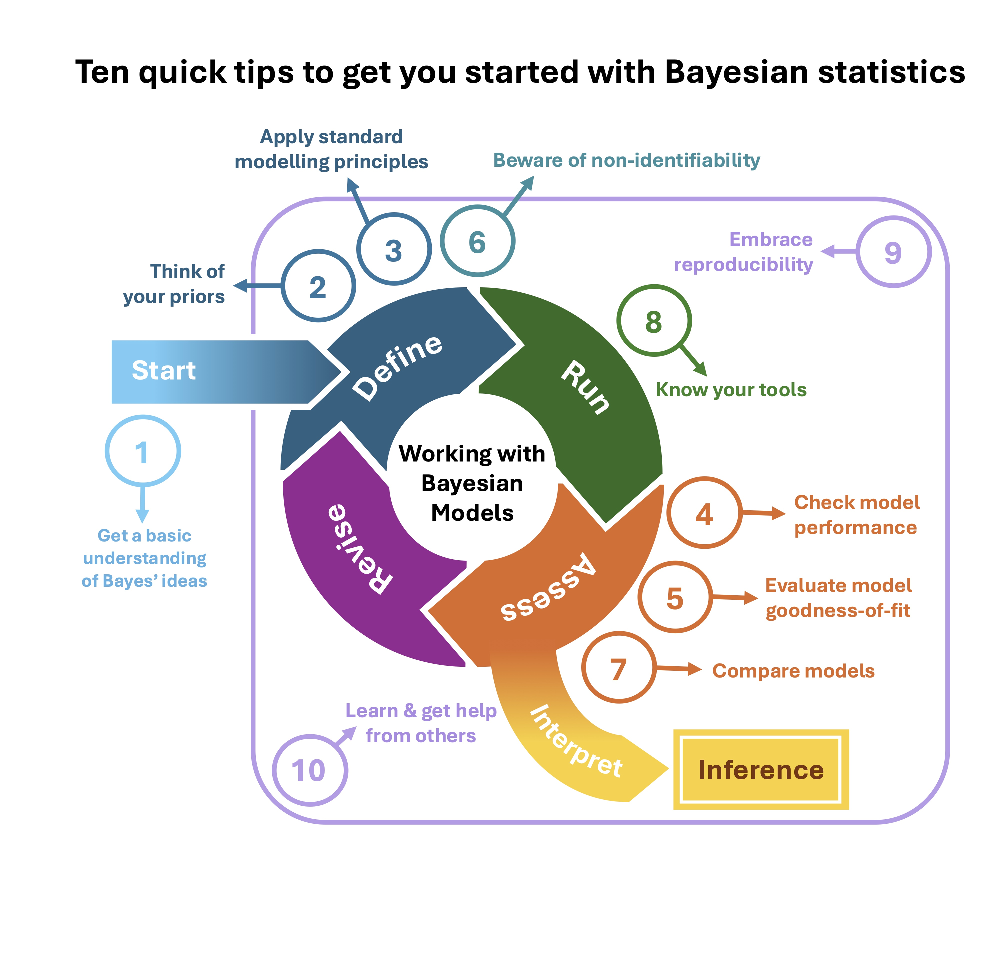

```{r setup, include = FALSE}
knitr::opts_chunk$set(cache = FALSE, 
                      echo = TRUE, 
                      message = FALSE, 
                      warning = FALSE,
                      fig.height=6, 
                      fig.width = 1.777777*6,
                      tidy = FALSE, 
                      comment = NA, 
                      highlight = TRUE, 
                      prompt = FALSE, 
                      crop = TRUE,
                      comment = "#>",
                      collapse = TRUE)
knitr::opts_knit$set(width = 60)
library(tidyverse)
library(reshape2)
theme_set(theme_light(base_size = 16))
make_latex_decorator <- function(output, otherwise) {
  function() {
      if (knitr:::is_latex_output()) output else otherwise
  }
}
insert_pause <- make_latex_decorator(". . .", "\n")
insert_slide_break <- make_latex_decorator("----", "\n")
insert_inc_bullet <- make_latex_decorator("> *", "*")
insert_html_math <- make_latex_decorator("", "$$")
```

# This workshop

## Objectives

* Try and demystify Bayesian statistics, and what we call MCMC.
* Make the difference between Bayesian and Frequentist analyses.
* Understand the Methods section of ecological papers doing Bayesian stuff.
* Run Bayesian analyses, safely hopefully.

## What's on our plate? 

+ Section 1 - Motivation and Bayes theorem. 

+ Section 2 - Markov chain Monte Carlo algorithms (MCMC). 

+ Section 3 - Introduction to `NIMBLE` and `brms`.

+ Section 4 - Priors. 

+ Section 5 - Case studies and GLMMs.

+ Section 6 - Conclusions.


# Free the modeler in you (M. Kéry)

+ Uses probability to quantify uncertainty for everything (propagation of uncertainty).

+ Allows use of prior information (‘better’ estimates: avoid boundary param estimates, acknowledge existing knowledge).

+ Can fit complex (hierarchical) models with same MCMC algorithms.

+ Credible intervals make more sense than confidence intervals


# With great tools come great responsabilities

+ Checking convergence is painful.

+ Specifying priors might be tricky.

+ Model adequacy should be checked (posterior predictive checks - not covered).

+ Computational burden can be high.

# Tips and tricks

<https://hal.science/CEFE/hal-04731240v2>

```{r, out.width = '55%',fig.align='center',echo=FALSE}

```

# So what?

+ Make an informed and pragmatic choice.

+ Are you after complexity, speed, uncertainties, etc?

+ Talk to colleagues.

